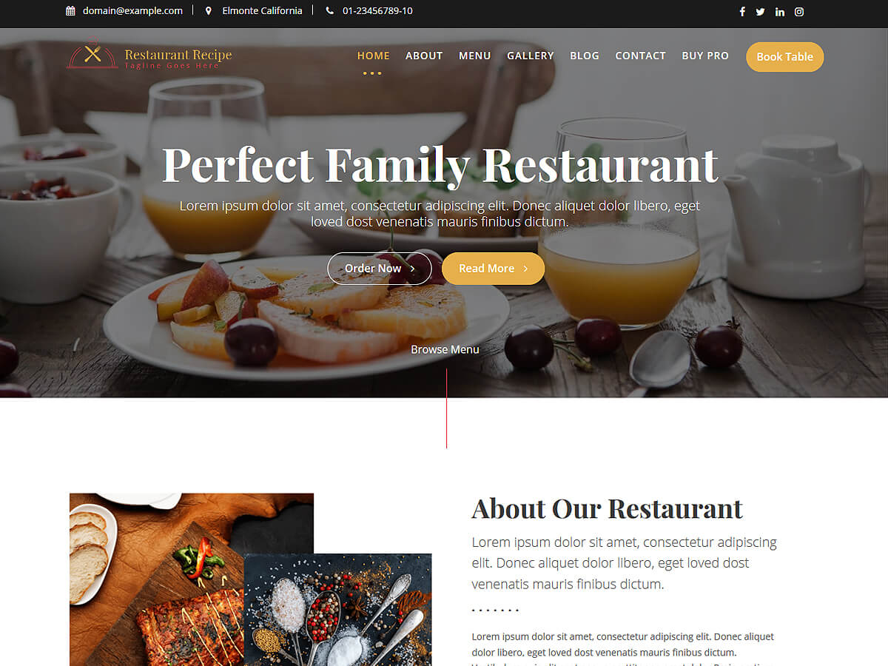

# Restaurant Recipe

**Contributors:** acmethemes  
**Requires at least:** 6.6  
**Tested up to:** 7.0  
**Requires PHP:** 7.4  
**Stable tag:** 4.0.0  
**License:** GPLv2 or later  
**License URI:** https://www.gnu.org/licenses/gpl-2.0.html  

> 

Restaurant Recipe is a beautifully designed WordPress theme for restaurants, cafés, coffee shops, bakeries, and any food or hospitality business. Its mouth-watering layout — with rich typography, captivating animations, and perfectly structured menu sections — makes it the ideal choice for showcasing your cuisine and atmosphere.

## Features

- **Unlimited featured slider** — showcase your dishes, interior, and specials
- **Up to four-column layouts** — flexible grids for menu categories
- **Page builder compatible** — design with Elementor, Beaver Builder, SiteOrigin
- **Post formats** — standard, gallery, image, and video for recipes and events
- **Category color options** — color-code menu sections (appetizers, mains, desserts)
- **WooCommerce compatible** — sell gift cards, merch, or online orders
- **Custom colors & background** — match your restaurant branding
- **Custom logo** — upload your restaurant logo
- **Editor-style support** — consistent editing experience
- **Footer widgets** — hours, location, contact, and social media
- **Breadcrumb navigation** — clear, SEO-friendly structure
- **Translation ready** — .pot file included
- **RTL support** — right-to-left language compatible
- **Responsive** — menus look great on phones and tablets

## Installation

1. Download the theme zip file.
2. In your WordPress admin, go to **Appearance → Themes**.
3. Click **Add New** → **Upload Theme**.
4. Select the zip file and click **Install Now**.
5. Click **Activate**.

## Frequently Asked Questions

### How do I install the theme?

In your admin panel, go to **Appearance → Themes**, click **Add New**, upload the zip file, and click **Activate**.

### How do I customize the theme?

Go to **Appearance → Customize** to adjust layout, colors, slider, and menu display options.

## Credits

Restaurant Recipe is built on [Underscores](https://underscores.me/) and licensed under GPLv2 or later. It bundles the following third-party resources:

- [Google Fonts](https://fonts.google.com/) — Apache License 2.0
- [Font Awesome](https://fontawesome.com/) — MIT / SIL OFL 1.1
- [normalize.css](https://necolas.github.io/normalize.css/) — MIT
- [Bootstrap](http://getbootstrap.com/) — MIT
- [Isotope](https://isotope.metafizzy.co/) — GPLv3
- [Magnific Popup](https://github.com/dimsemenov/Magnific-Popup) — MIT
- [Theia Sticky Sidebar](https://github.com/WeCodePixels/theia-sticky-sidebar) — MIT
- [Breadcrumb Trail](https://github.com/justintadlock/breadcrumb-trail) — GPLv2+
- [TGM Plugin Activation](http://tgmpluginactivation.com/) — GPLv2+
- [html5shiv](https://github.com/afarkas/html5shiv) — MIT
- [Respond.js](https://github.com/scottjehl/Respond) — MIT
- [Waypoints](https://github.com/imakewebthings/waypoints/) — MIT
- [WOW](https://github.com/matthieua/WOW) — MIT
- [Slick](https://github.com/kenwheeler/slick/) — MIT

---

[Demo](http://demo.acmethemes.com/restaurant-recipe) &middot; [Support](https://www.acmethemes.com/supports/) &middot; [Acme Themes](https://www.acmethemes.com)
